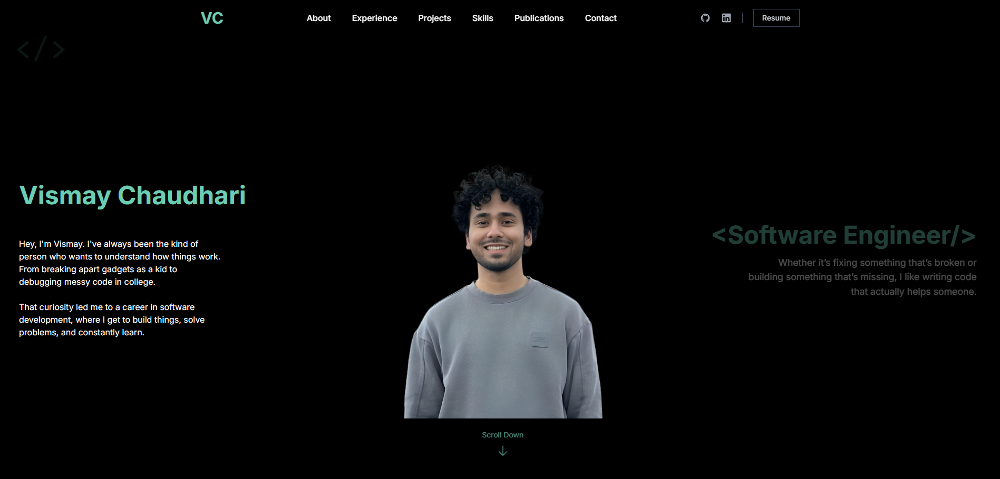

# Portfolio Website 🚀

This repository contains the source code of my personal portfolio website built using modern frontend technologies like React, TypeScript, Vite, and Tailwind CSS.

---

## Hero Page

<p align="center">
  
</p>

## Projects Page

<p align="center">
  
</p>

## Why I Built This

I wanted a minimal yet modern portfolio website that feels clean, responsive, and fast while clearly representing my projects, skills, and achievements.

This portfolio highlights my:

- Real-world Projects
- Technical Skills
- Publications
- Contact Info
- Timeline / Experience Journey

---

## Tech Stack Used

| Category   | Tech/Tools         |
| ---------- | ------------------ |
| Framework  | React + TypeScript |
| Styling    | Tailwind CSS       |
| Animations | Framer Motion      |
| Build Tool | Vite               |
| Hosting    | Vercel             |

---

## Folder Structure & Component Purpose

```
public/
├── images/           → All project & hero images

src/
├── components/
│   ├── Contact.tsx        → Contact form & personal details
│   ├── Footer.tsx         → Footer with navigation & social links
│   ├── Header.tsx         → Responsive Navbar with active link highlighting
│   ├── Hero.tsx           → Animated landing section with image transition on mouse movement
│   ├── Projects.tsx       → Project section with filtering (Web, Backend, AI tabs) and animation
│   ├── Publications.tsx   → List of Publications with expandable details
│   ├── Skills.tsx         → Skills categorized by domains with toggleable views & proficiency indicator
│   ├── Timeline.tsx       → Timeline of professional journey (Experience + Education)
│
├── App.tsx               → Main layout rendering all sections sequentially
├── main.tsx              → Entry Point
├── index.css             → Global styling
```

---

## How To Run Locally

```bash
git clone https://github.com/veeoid/portfolio_v2.git
cd portfolio-redesign
npm install
npm run dev
```

---

## Deployment

This portfolio website is deployed on:  
🔗 [https://portfolio-ca88.vercel.app/](https://portfolio-ca88.vercel.app/)

---

## Images Used in Portfolio

| Image          | Purpose                                    |
| -------------- | ------------------------------------------ |
| animated.png   | Hero Section Right Hover                   |
| regular.png    | Hero Section Left Hover                    |
| center.png     | Neutral Hero State                         |
| Project Images | Inside `/public/images/` for Projects Grid |
| resume.pdf     | Available for download in Header           |

---

## Features

- Animated Hero Section with hover-based transitions
- Responsive & Mobile Friendly
- Projects Filtering with Tabs
- Skill Category Toggle with Proficiency Bar
- Timeline for showcasing journey
- Publications section with details & DOI links
- Contact Form with submission simulation
- Dark Aesthetic with smooth transitions

---

## Contact Me

- Email: vismaychaudhari7@gmail.com
- LinkedIn: [https://linkedin.com/in/vismay-chaudhari/](https://linkedin.com/in/vismay-chaudhari/)
- GitHub: [https://github.com/veeoid](https://github.com/veeoid)

---
